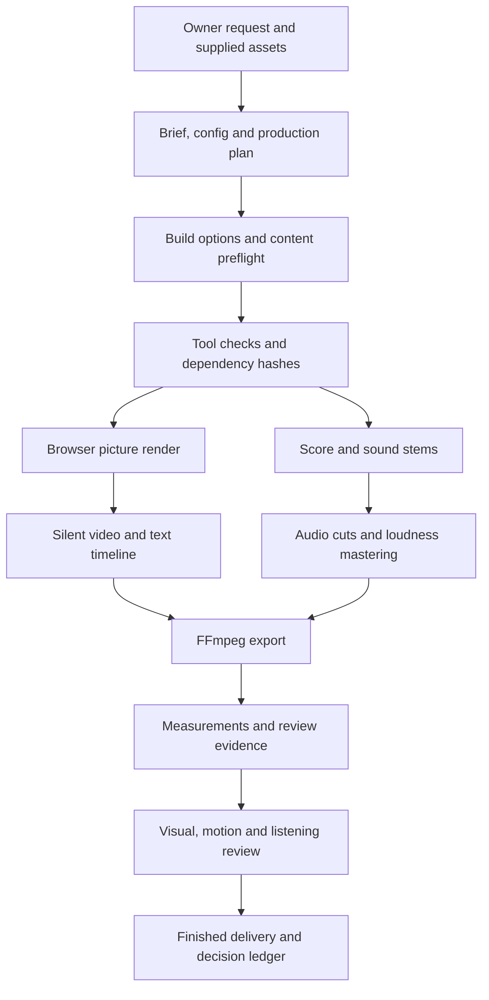

# Animation studio architecture and working guide

Studied on 2026-10-03 at repository commit `eb2a6c4`. This guide describes the code in this checkout and the checks performed on the owner's Windows machine. Historical film results are documented evidence from earlier runs, not proof that those films can be rebuilt from this clone.

The repository is an agent-operated, code-driven film studio. Node orchestrates production, browser modules draw deterministic frames, Python optionally prepares media and analysis, and FFmpeg handles encoding, sound processing and export. It has no general editing dashboard, database, account system or hosted AI backend. The host agent supplies the creative reasoning and tools for visual review; the repository itself does not call an AI model.

## Which instructions describe the current studio

- [STATUS.md](../STATUS.md) is the current scope and handoff. Closed work and roadmaps are not an automatic work queue.
- [WORKFLOW.md](WORKFLOW.md) defines draft, review and final builds, targeted iteration and artistic acceptance.
- [AUTONOMOUS_FILM.md](AUTONOMOUS_FILM.md) defines owner-facing film delivery: the agent handles internal decisions and returns one requested finished video.
- [SKILLS.md](SKILLS.md) routes the 27 project skills in `../.claude/skills/` by department.
- [QUALITY_PLAYBOOK.md](QUALITY_PLAYBOOK.md), [CRAFT.md](CRAFT.md) and [TECHNIQUES.md](TECHNIQUES.md) hold production method, lessons and reusable recipes.
- `../PLAN.md` is explicitly superseded. Its HyperFrames-first architecture, setup commands and proposed folder tree are historical. The implemented native composer is primary.

For production, preserve source truth, use one deliberate concept, inspect hook/proof/payoff frames, build a short proof, then expand. Ordinary creative choices do not require owner approval pauses. Allow at most two correction rounds per requested scope. Technical checks and a separate artistic judging pass serve different purposes.

## Main production path



`make.mjs` is the production entry point. It imports `<film>/config.mjs`, parses delivery/profile/range selection, loads the plan, validates the engine and runs the doctor before expensive work. Review and final builds generate or reuse the soundtrack; drafts skip it. Each build creates a numbered `out/<film>/takeNN/` folder. Reusable intermediates and their cache manifests live under `takes/<film>/`.

The native picture path is `make.mjs` → `lib/render.mjs` → `lib/serve.mjs` + `lib/cdp.mjs` → `lib/composer.html` → the film module. Captured images stream to FFmpeg. Workers render independent time slices, which are concatenated without re-encoding. Review/final builds also sample text, assemble and master sound, mux the picture, measure the exported MP4, and produce review artifacts. A failure in a technical gate gives a failing build exit status; a passing build explicitly still requires artistic review.

## The contracts between film files

| File | Responsibility |
|---|---|
| `BRIEF.md` | Audience, message, evidence, references, direction and deliberate assumptions |
| `config.mjs` | Module paths, canvas, fps, sound targets, deliveries, safe rectangles and optional renderer settings |
| `production.json` | Assets and rights, shot coverage and purpose, copy intervals, craft metadata, sound and optional creative/cue/music-map data |
| `film.js` | Browser-side composition, initialized once and rendered at any requested time |
| `score.mjs` | Generate or assemble the soundtrack and write `mix.wav`, `music.wav`, `sfx.wav` into the film's `takes` folder |
| `LEDGER.md` | Timecoded issues, severity, fixes, results, intentional exceptions and unverified work |

The browser film exports a default object with `duration`, `fps`, `init(stage, { W, H, variant })` and `render(t, frame)`. An optional `camera(t)` enables diagnostics. `init` builds the scene; `render` calculates its current state. It may return a promise, which the composer awaits before capture, allowing footage frames to finish decoding. Modules can register other resource promises through `window.studioWait`.

The composer waits for resources and exposes `window.ready`, `renderAt`, `textBoxes`, duration and fps. It can map delivery time onto source-film time using `segments` and add an end fade. Cut-downs preserve the authored frame index. Lower preview fps likewise does not change authored frame-dependent motion.

Frames must be determined by time and a seed, independent of prior playback. Avoid wall-clock animation, unseeded randomness and accumulating simulation state. Repeated and reverse seeks must produce the same picture. DOM, SVG, Canvas and optional WebGL2 are available; WebGL uses explicit uniforms and requires the renderer's GPU option. The default browser path disables GPU, and the opt-in shader path requests SwiftShader.

Text intended for automated read-back must use the `.line` and `.word` convention. Canvas text or arbitrary DOM labels do not automatically enter this check. Arabic text is animated by whole words to preserve shaping. Depth/focus effects should be applied to scene layers, with readable copy outside those filters.

## Delivery selection and profiles

`lib/build-options.mjs` owns strict flag parsing and frame bounds. New films declare `ownerRequest: { delivery, w, h, duration, fps }`; selection must contain exactly that delivery and match its dimensions, duration and authored fps. Final builds cannot use a partial range. Legacy configs without `ownerRequest` can export several deliveries.

| Profile | Picture settings | Work |
|---|---|---|
| draft | Half scale, JPEG 85, 15 fps, CRF 26 ultrafast | One delivery, first 12 seconds by default, silent preview with basic size/fps/duration check |
| review | Authored size/fps, JPEG 95, CRF 20 veryfast | One selected delivery or interval, mastered sound, text and technical checks, review evidence |
| final | Authored size/fps, PNG, CRF 14 slow | Whole selected deliveries, mastering, measurements, review evidence and configured sharing extras |

`--shot=id[,id]` is converted into the encompassing shot interval with 0.5 seconds of context on either side. `--range` uses delivery time; shot definitions use source-film time. Do not assume these are interchangeable for segmented deliveries. Capture dimensions are padded to even values for H.264. `config.dither` opts into a higher-bit-depth, error-diffused color conversion to reduce banding.

Reference command shapes from `studio/`:

```text
node make.mjs showreel
node make.mjs showreel --profile=review --range=0:3
node make.mjs showreel --profile=final
node make.mjs film6 --profile=review --shot=hook
node reference.mjs analyze <local-video> --slug=<new-name>
node reference.mjs review <pack> --observations=<review.json>
node reference.mjs direct <pack> --brief=<direction.json>
```

These describe the interfaces, not confirmed Windows render commands. The shot ID must exist in the selected plan, and the browser/tool setup and assets must be ready first.

## Module map

| Area | Main files and purpose |
|---|---|
| Motion foundation | `lib/motion.js`: interpolation, keyframes, seeded randomness, DOM/SVG helpers, word animation and grain |
| Motion mechanics | `lib/kinetics.js`: analytic springs, retargeting, inertia, anticipation, stagger, noise, paths and counters |
| Camera and depth | `lib/cinema.js`, `lib/depth.js`: camera choreography, diagnostics, parallax planes, focus, haze, coverage clamps and shadows |
| Typography and layout | `lib/typography.js`, `lib/layout.js`: shaped words, fitting, reveals, aspect-specific slots and safe areas |
| UI motion | `lib/uimotion.js`, `lib/uimorph.js`: tilted cards, typewriter, stacks, orbits, container morphs, cursor gestures, portals and logo particles |
| Visual effects | `lib/transitions.js`, `lib/fx.js`, `lib/particles.js`, `lib/gpu.js`: motivated transitions, effects, seeded particles and shaders |
| Asset preparation | `lib/imagelab.mjs`, `lib/imagelab-page.html`, `lib/layers.mjs`, `tools/logo_trace.py`: masks, plates, image workbench and faithful raster-logo tracing |
| Music and sound | `lib/audio.mjs`, `lib/sfx.mjs`, `lib/music.mjs`: 48 kHz stereo synthesis, accents and recording preparation |
| Music and cue timing | `lib/musicmap.mjs`, `lib/rhythm.mjs`, `lib/cues.mjs`, `lib/cuesheet.js`: analysis/grid evidence and a shared picture/sound cue sheet |
| Production validation | `lib/production.mjs`, `lib/creative.mjs`: coverage, source truth, copy budget, craft fields and advisory repetition findings |
| Rendering and reuse | `lib/render.mjs`, `lib/cdp.mjs`, `lib/serve.mjs`, `lib/cache.mjs`, `lib/build-options.mjs` |
| Export and evidence | `lib/finish.mjs`, `lib/measure.mjs`, `lib/review.mjs`: sound mastering, muxing, share copies, captions, gates and review galleries |
| Real product screens | `lib/app-capture.mjs`, `lib/screen.js`: drive actual app states, verify displayed values, capture screenshots and retain element boxes |
| Specialist engines | `lib/engines.mjs`: a command adapter for silent picture; native audio, export and QA remain in the studio |
| Live action | `tools/live.py`, `lib/footage.js`, `lib/edl.mjs`, `lib/dialogue.mjs`: analysis packs, compositing, edits, captions and voice/music mixing |
| Reference lab | `reference.mjs`, `reference/`: bounded ingestion, measurements, visual interpretation, neutral studies and matched comparisons |

External engines are adapters, not installed HyperFrames or Remotion implementations. They must write picture at the required size, fps and duration. Segments and fades are currently rejected for external rendering. Native DOM text read-back is unavailable there and explicitly reported as unchecked.

## Validation and its limits

Production preflight rejects malformed plans, missing local assets, unknown asset IDs, invalid shot intervals, uncovered timeline, missing shot purpose and unsupported craft data. Product claims require evidence; a reference asset cannot substitute for product evidence. Rights and licensed-music scope become blocking for final production. Copy speed and some repetition findings are warnings requiring inspection. Legacy films without a plan remain compatible but cannot claim content preflight coverage.

Export checks measure dimensions, fps, duration, loudness, true peak, loudness range, frozen passages, black passages, text safety/overlap and configured share size. Since the Windows port (2026-10-03), the duration gate is frame-accurate: it allows one frame plus 30 ms of container slack. Before that it allowed ±10 percent. Intentional static holds and dark passages must be declared.

Text is sampled every 0.1 seconds. Review evidence adds boundary strips, reading holds, crops, camera peaks, contrast/reading-time estimates, motion energy, composition similarity, silence and cue alignment where available. These are samples and advisory findings. They cannot establish attractive art direction, semantic accuracy, continuous readability or pleasing sound. Manual inspection of the actual export and listening remain necessary.

Audio editing uses duration-preserving edge fades to suppress clicks, not overlapping crossfades. Mastering measures the result after loudness processing. Muxing refuses audio shorter than picture. Share copies use two-pass encoding and must be inspected independently. Caption export uses the read-back timeline; missing translations fall back to the original text.

## Cache and artifact ownership

Caches hash input content, settings and output content. Preserved timestamps cannot hide a changed file; missing or corrupted outputs rebuild. Score, picture, text and audio masters have separate cache records. Shared code/assets are conservative picture dependencies. Score changes alone can preserve picture reuse, but changes elsewhere in the film folder can invalidate the selected picture. There is no automatic per-shot reuse; use a targeted range during iteration.

Use `production.assets`, `config.cacheInputs` and external-engine inputs to declare dependencies outside the normal folders. Repository cloning does not restore `source/`, `plates/`, licensed recordings, models, `takes/`, `out/` or private reference packs. Both ignore files enforce this separation. Keep future client material and generated deliveries local.

## Reference analysis workflow

`reference.mjs analyze` accepts a local video, direct media URL or browser video. Local media goes through FFmpeg; browser media uses CDP. It creates a new evidence directory and refuses to overwrite an existing one. Default limits include 72 frames, 300 seconds and 128 MiB for downloads; a frame budget must be 24–160.

The machine pass builds metadata, candidate cuts/shots, overview/transition sheets, motion measurements, music evidence, audiovisual relationships, a scientific summary, a provisional reconstruction plan and a review draft. It distinguishes machine completion from pending visual interpretation. Raw evidence remains in the local pack.

A reviewer must inspect actual evidence and supply observations with uncertainty. `review` validates image references and updates the plan; artistic DNA carries evidence-linked interpretation. `direct` turns reviewed principles into an original-subject direction. `reconstruct` produces an original neutral study after the required review checks; `--study` is an explicitly provisional alternative. `compare` aligns reference and study intervals. `learn` stores a transferable principle only after an inspected-motion review, with evidence, counter-case, application and confidence.

For detailed questions, `timeline`, `strip`, `track` and `audio` invoke optional Python forensics. `refine` is restricted to justified intervals of at most two seconds, 2–12 samples and at most two refinement rounds. Motion/easing estimates describe pixels, not recovered source-project keyframes or proof of the original editing software.

## Live action workflow

`tools/live.py` prepares a footage pack: conformed frames/audio, speech, transcript, cuts, person mattes, tracked landmarks, free-space estimates and a crop trajectory. Model-backed operations require Python packages and downloaded models. The code includes Silero VAD, sherpa-onnx Whisper/Piper and MediaPipe paths. Heavy matting, object removal and other models discussed in `LIVE_ACTION.md` remain roadmap items rather than implemented interchangeable backends.

Scripted word alignment distributes words over detected speech and anchors them on pauses; it is not a general word-exact Arabic forced aligner. The earlier known-script timing experiment is not a guarantee for arbitrary unscripted speech.

`lib/footage.js` decodes the requested frame and matte before capture. Its layer order is plate → behind graphics → person cutout → front graphics. Normalized tracked anchors are projected through the current crop/zoom into stage coordinates. `lib/edl.mjs` provides speech-based cuts, text-based word removal, timeline/source mapping, punch-ins, caption pages and OTIO JSON. `lib/dialogue.mjs` constructs FFmpeg voice polish and sidechain ducking graphs.

## Worked projects and available inputs

| Project | What it teaches | State in this clone |
|---|---|---|
| `film1` | Initial ideas | Notes only |
| `film2`, `film3` | BALACONBAR ads, several formats and cut-downs | Source modules present; legacy plans absent; client media not restored |
| `film4`, `film5` | Planned product ads and tighter art direction | Plans present; client images and prepared plates missing |
| `film6` | Pixel Plus: one pixel links ads, animation, software and logo payoff | Source and plan present; logo, traces/plates and references missing |
| `showreel` | Native motion/camera/type capabilities at 16:9 and 9:16 | Final content preflight has no blocking errors |
| `showreel2` | Reference grammar translated into original geometry at 60 fps | Final content preflight has no blocking errors |
| `live1` | Real person with behind/front graphics, freeze, tracking and captions | Source present; footage, pack and voice missing |
| `examples/` | Small studies of depth, camera, type, particles, shaders, UI, product capture and music sync | Focused implementation examples; many are direct film modules rather than complete make projects |

Passing content preflight for the showreels does not confirm browser rendering or final delivery on Windows. Film ledgers document earlier local exports, most of which are not available here to view or listen to.

## Windows findings and verification

The local checks used Node **25.2.1** and FFmpeg **9.0.1**. Python **3.12.10** is installed under `python.exe`. A `find_spec` inventory found NumPy and ONNX Runtime; SciPy, OpenCV, librosa, MediaPipe, sherpa-onnx, soundfile, PySceneDetect and OpenTimelineIO were absent. This inventory checks package discovery, not successful imports or model execution.

The initial sandboxed test command failed before test execution because Node could not spawn its test workers (`EPERM`). The authorized run outside the sandbox completed:

```text
Command: npm.cmd test (working directory: studio)
Tests: 109
Passed: 87
Failed: 3
Skipped: 19
Duration: 175.0 seconds
```

All three failures were in `test/reference.test.mjs`: local reference analysis, direct media URL analysis and static silent reference analysis. Each reported `ffmpeg failed (3221225477): Fontconfig error: Cannot load default config file: File not found`. Reference contact sheets call `drawtext` without an explicit font file in `reference/common.mjs`; that is a likely integration point to investigate, not a verified fix. The detailed transcript from this investigation is `takes/app-study-tests.txt` (local, ignored).

Passing tests covered motion mechanics, camera/depth math, typography/layout helpers, UI morphs, cache invalidation, delivery enforcement, production/creative schemas, documentation coverage, music analysis, cue timing, edit decisions, real audio ducking and video-stream duration probing. Browser-render integration was not enabled. Optional Python checks were skipped according to their existing detectors and flags. The Linux CI workflow is `.github/workflows/studio-tests.yml`; its current remote result was not checked.

Observed portability concerns to address before production on this machine:

1. Browser discovery checks Linux locations or `STUDIO_CHROMIUM`; it returned `null` here. The renderer launches a browser directly through `spawn`, which must be reconciled with the owner's mandatory Chrome launcher policy before using it locally.
2. CLI guards in several modules compare `import.meta.url` with a raw `file://${process.argv[1]}`. Windows paths and this workspace's spaces make that comparison unreliable; such commands can return without running their CLI body. `reference.mjs` already uses `pathToFileURL`.
3. `package.json` uses POSIX environment assignment for `test:render`; the doctor also invokes Linux commands such as `fc-list` and `df`, and many Python callers use `python3`.
4. `finish.mjs` uses `/dev/null` for share-copy pass one; `render.mjs` uses filesystem paths in URLs and FFmpeg concat lists, plus image globbing for still sheets. These need Windows verification/adaptation rather than assumed compatibility.
5. The three reference failures are confirmed local problems. Full browser rendering, shader behavior, share exports and model-backed footage analysis remain unverified.

**Update, same day (Windows port scope):** items 1–5 above are fixed. Chrome is found and launched headless with a throwaway profile, the CLI guards use `isMain`, `PYTHON`/`devNull`/concat lists replace the POSIX idioms, and `drawtext` has a font file. Details are in `TECHNIQUES.md` "Cross-platform" and `CHANGELOG.md`.

The learning scope is complete. It did not change application behavior, install models, restore client assets, fix portability issues, produce a film or certify production readiness. Future implementation should use this map and the current request to select the relevant module and bounded checks.
